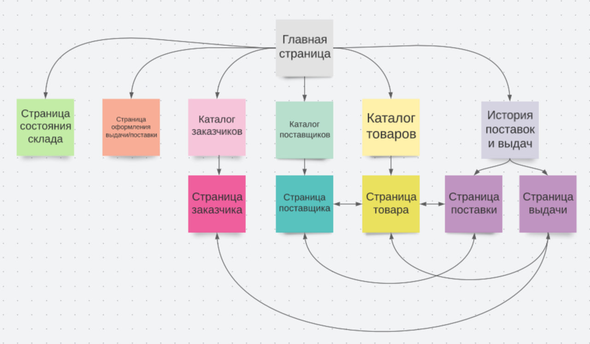
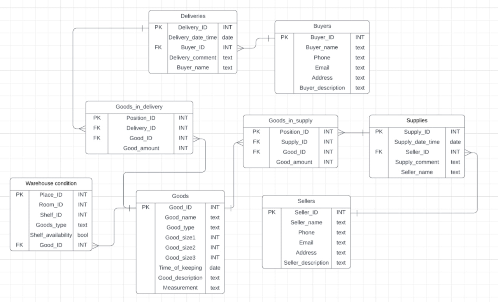

Складской учет
=======================
Описание страниц
-----------------------
Целевой пользователь - администратор или менеджер склада

На каждой странице будет раскрывающееся меню:
- Ссылка на главную страницу
- Ссылка на страницу поставщиков
- Ссылка на страницу заказчиков
- Ссылка на страницу с каталогом имеющихся товаров
- Ссылка на страницу поставок и выдач
- Ссылка на страницу состояния склада
- Ссылка на страницу формирования поставки или заказа

### Главная страница

Представляет собой несколько дашбордов, все заголовки которых являются ссылками на соответствующие страницы:
- Ближайшие выдачи (ссылка на страницу поставок и выдач)
- Ближайшие поставки (ссылка на страницу поставок и выдач)
- Количество свободных ячеек разных типов (ссылка на страницу состояния склада)

### Каталог имеющихся товаров
Поиск товара с возможностью фильтрации и сортировки по различным параметрам. Список найденных товаров - их карточки с быстрой информацией, по нажатию на которые происходит переход на страницу товара.

### Страница товара
Поставщики, количество в наличии, ближайшие поставки, сроки хранения, габариты, место на складе и т. д.
Все данные можно редактировать.

### Каталог поставщиков
Поиск поставщика с возможностью фильтрации и сортировки по различным параметрам. Список найденных поставщиков - их карточки с быстрой информацией, по нажатию на которые происходит переход на страницу поставщика.

### Страница поставщика
Контактная информация, история поставок и т. д. Все данные можно редактировать.

### Каталог заказчиков
Поиск заказчика с возможностью фильтрации и сортировки по различным параметрам. Список найденных заказчиков - их карточки с быстрой информацией, по нажатию на которые происходит переход на страницу заказчика.

### Страница заказчика
Контактная информация, история заказов и т. д. Все данные можно редактировать.

### История поставок и выдач
Список карточек - быстрая информация о поставке или выдаче. Возможен поиск, фильтрация и сортировка.

### Страница поставки
Дата и время поставки, оформления, список товаров, поставщик и т. д. Все данные можно редактировать

### Страница заказа
Дата и время выдачи, оформления, список товаров, поставщик и т. д. Все данные можно редактировать

### Страница формирования и оформления заказа или поставки
Форма с полями даты и времени выдачи или поставки, заказчике или постащике, товарах и т. д. Встроенная проверка наличия товаров или свободного места на складе.

### Страница состояния склада
Перечисление свободных ячеек разных типов. Форма для проверки наличия свободного места.

Схема навигации между страницами
-----------------
Дополнительно на каждой странице есть доступ к вышеописанному меню.

Схема базы данных
-----------------

Сценарии использования
----------------------
- Получение списка имеющихся товаров по видам, сроку хранения, поставщику и пр.
  - Перейти на страницу каталога товаров, нажав на заголовок дашборда или из главного меню.
  - Выбрать нужные фильтры и способ сортировки.
  - Нажать кнопку "Поиск".

- Получение данных о поставках и выдачах за заданный период времени
  - Перейти на страницу истории поставок и выдач, нажав на заголовок дашборда или из главного меню.
  - Выбрать нужные фильтры и способ сортировки.
  - Нажать кнопку "Поиск".

- Оформление поставки или выдачи
  - Перейти на страницу оформления поставок и выдач из главного меню.
  - Заполнить все обязательные поля и необязательные поля по необходимости. 
  - Нажать кнопку "Подтвердить оформление поставки или выдачи".

- Проверка наличия свободного места для поставки
  - Перейти на страницу состояния склада, нажав на заголовок дашборда или из главного меню.
  - Заполнить форму.
  - Нажать кнопку "Проверить наличие места".

- Добавление и удаление товара, чтение и редактирование данных о нем
  - Перейти на страницу каталога товаров из главного меню.
  - Найти необходимый товар.
  - Перейти на страницу товара, нажав на его карточку.
  - Нажать кнопку "Изменить".
  - Внести изменения.
  - Нажать кнопку "Сохранить изменения" или "Удалить товар".

- Добавление и удаление поставщиков и потребителей, чтение и редактирование данных о них
  - Перейти на страницу каталога поставщиков или потребителей из главного меню.
  - Найти необходимого поставщика или потребителя.
  - Перейти на страницу поставщика или потребителя, нажав на его карточку.
  - Нажать кнопку "Изменить".
  - Внести изменения.
  - Нажать кнопку "Сохранить изменения" или "Удалить поставщика/потребителя".
